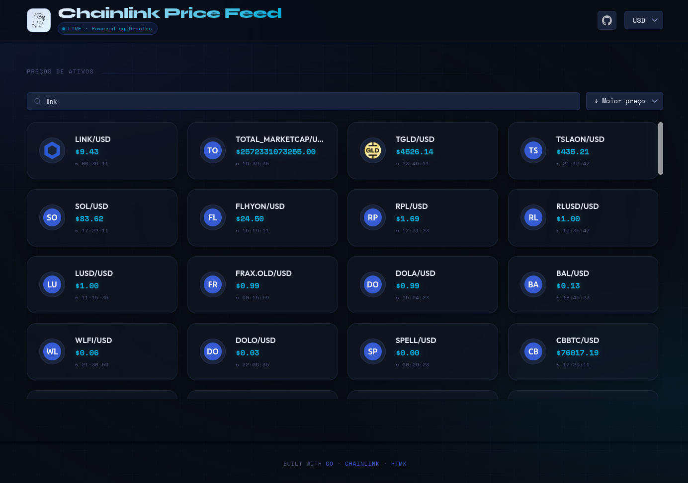

<div >
  
  <br>
  
  
  
  
  
</div>

<br>

<h1 >Chainlink Price Feed com GO</h1>

<p >
  Esta API, desenvolvida em <strong>Go</strong>, atua como uma ponte para os <strong><a href="https://docs.chain.link/data-feeds/price-feeds/addresses?page=1&testnetPage=1&testnetSearch=1">Chainlink Data Feeds</a></strong>, permitindo que aplicações acessem dados de preços da <strong>blockchain Ethereum</strong> de forma simples e eficiente.
</p>

<p >
  A aplicação se conecta a um <strong>nó da rede Ethereum</strong>, interage com os <strong>contratos inteligentes da Chainlink</strong> para buscar os preços de ativos e os expõe através de uma API RESTful. Além disso, a aplicação inclui uma <strong>interface web simples</strong> (feita com HTMX) para visualizar esses preços.
</p>

<div >
  
</div>

## 🎨 Demo

Acesse a aplicação rodando em produção:

- **Web Interface:** [https://crypto.dev-araujo.com.br/](https://crypto.dev-araujo.com.br/)





---

## 🛠️ Stack

* **[Go](https://golang.org/)**: Linguagem principal.
* **[Gin](https://github.com/gin-gonic/gin)**: Framework web de alta performance.
* **[Go-Ethereum](https://github.com/ethereum/go-ethereum)**: Cliente para interação com a blockchain.
* **[Docker](https://www.docker.com/)**: Containerização da aplicação.
* **[HTMX](https://htmx.org/)**: Interatividade no frontend sem complexidade de SPAs.

## 🚀 Executando a aplicação

Siga as instruções abaixo para ter uma cópia do projeto rodando em sua máquina.

### Pré-requisitos

* [Go](https://golang.org/doc/install) (1.24.4+)
* [Docker](https://docs.docker.com/get-docker/) (Opcional, mas recomendado)

### Instalação

1. Clone o repositório:
```sh
git clone [https://github.com/dev-araujo/chainlink-price-feed.git](https://github.com/dev-araujo/chainlink-price-feed.git)
cd chainlink-price-feed


```

2. Configure as variáveis de ambiente:

```sh
cp .env.example .env


```

3. Edite o arquivo `.env` inserindo sua URL RPC (Infura/Alchemy):

```json
RPC_URL="[https://mainnet.infura.io/v3/SEU_ID_DO_INFURA](https://mainnet.infura.io/v3/SEU_ID_DO_INFURA)"
SERVER_PORT="8080"
GIN_MODE="release"
WEB_PORT="8081"
API_URL="http://localhost:8080"


```

> **💡 Dica:** Para testes, você pode obter um RPC gratuito em [Public Node](https://ethereum.publicnode.com/).

---

### Opção 1: Docker (Recomendado)

Para iniciar todo o ambiente (API + Web) com um único comando:

```sh
docker-compose up --build


```

* A **API** estará disponível em `http://localhost:8080`
* A **Aplicação Web** estará disponível em `http://localhost:8081`

---

### Opção 2: Rodando Localmente (Sem Docker)

⚠️ **Atenção:** Certifique-se de executar os comandos sempre a partir da **raiz do projeto** (`chainlink-price-feed/`) para que a aplicação consiga encontrar as pastas de arquivos estáticos (`web/` e `assets/`).

Você tem duas formas de executar a aplicação localmente:

#### Forma A: Aplicativo Unificado (Tudo em um)

Esta é a maneira mais simples, executando tanto a API quanto a Interface Web num único processo.

```sh
go run cmd/app/main.go

```

*A aplicação completa estará disponível na porta definida em `SERVER_PORT` (padrão: 8080).*

#### Forma B: Executando os serviços separadamente

Se preferir rodar a API e a aplicação web de forma independente:

**1. Iniciando a API (Backend)**

```sh
go run cmd/api/main.go

```

*A API iniciará na porta definida em `SERVER_PORT` (padrão: 8080).*

**2. Iniciando a Aplicação Web (Frontend)**
Em um novo terminal, ainda na raiz do projeto, execute:

```sh
go run cmd/web/main.go

```

*A interface web iniciará na porta definida em `WEB_PORT` (padrão: 8081).*

---

## 📡 Endpoints da API

A API fornece os seguintes endpoints para consulta:

| Método | Endpoint | Descrição |
| --- | --- | --- |
| `GET` | `/health` | Verifica o status da API. |
| `GET` | `/api/price/:asset/usd` | Retorna o preço do ativo em USD. |
| `GET` | `/api/price/:asset/brl` | Retorna o preço do ativo em BRL. |
| `GET` | `/api/price/all/usd` | Retorna todos os ativos em USD. |
| `GET` | `/api/price/all/brl` | Retorna todos os ativos em BRL. |

**Ativos Suportados (`:asset`):**
`btc`, `eth`, `link`, `uni`, `1inch`, `paxg`, `stx`

### Exemplos de Resposta

**GET** `/api/price/eth/usd`

```json
{
    "pair": "ETH/USD",
    "price": "3000.00",
    "timestamp": 1678886400,
    "imageUrl": "[https://cryptologos.cc/logos/ethereum-eth-logo.png?v=040](https://cryptologos.cc/logos/ethereum-eth-logo.png?v=040)"
}


```

---

## Author 👷


**Adriano P Araujo** 
<br>
[](https://www.linkedin.com/in/araujocode/)
<br>
[](https://github.com/dev-araujo)

